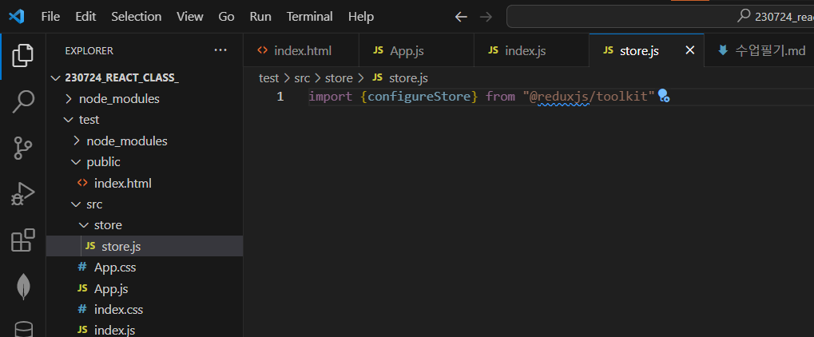
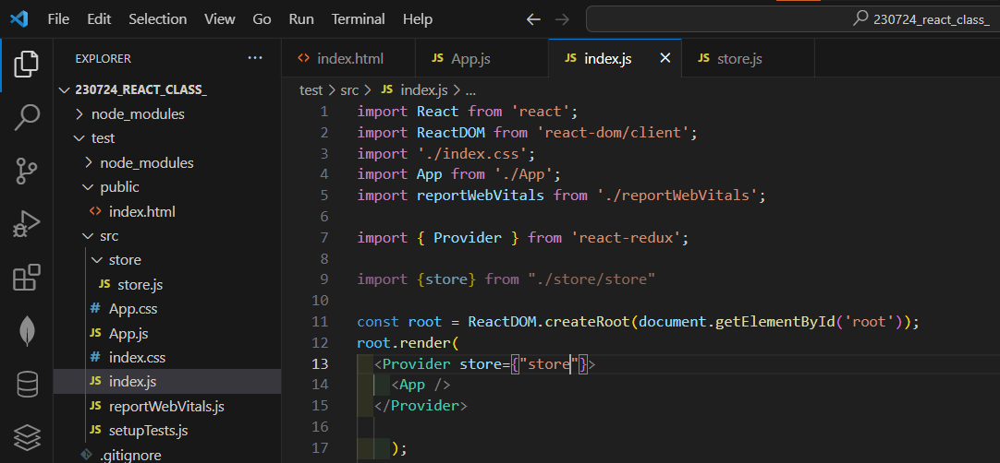

react에서 불변성 을 유지하는 코드를 작성할 수 있게 도와주는 라이브러리
npm i immer 

react 에서 기본적으로 부모에서 받은 props 를 내부 상태인 state 가 변경되었을 때 
다시 리렌더링을 하는 

이때도, props 와 state 의 변경을 불변성을 이용해서 감지한다. 

객체 참조를 복사한다는 점을 이용해서, 비교하는 '얕은 비교'를 통해 변경이 이루어진다. 

<br>

'얕은 복사' vs '깊은 복사' 
- 값만 복사 vs 주소 복사 
- 자바스크립트 는 주소 복사 같은건 없음 
- c++ 관심있으면 알면 좋음 


즉, 
...state 로 해줘야 -> 어? 변했네? 라고 인지

---


```
npm install @reduxjs/toolkit
```

- 폴더 store 



- 저장소 셋팅 



countSlice.jsx 에 리듀서 함수를 만들어서 내보내기 


---

- 리액트, 리덕스  
npm install redux react-redux 

---

redux를 익숙하게 하고 나서, redux-toolkit 을 쓰는게 좋음 ⭐⭐⭐


